# Notification Services Suite - Architecture & Flow Documentation

This document provides a comprehensive visual explanation of how the Notification Services Suite works.

## 📋 Table of Contents

1. [System Overview](#system-overview)
2. [Architecture Diagram](#architecture-diagram)
3. [Service Details](#service-details)
4. [Request Flow](#request-flow)
5. [Data Flow](#data-flow)
6. [Message Queue Flow](#message-queue-flow)
7. [Technology Stack](#technology-stack)

---

## 🎯 System Overview

The Notification Services Suite is a **distributed microservices system** that handles sending email and push notifications to users. It's designed with:

- **5 Microservices**: API Gateway, User Service, Email Service, Push Service, Template Service
- **3 Infrastructure Services**: PostgreSQL, Redis, RabbitMQ
- **Asynchronous Processing**: Using message queues for scalability
- **RESTful APIs**: For synchronous communication
- **Containerized**: All services run in Docker containers

---

## 🏗️ Architecture Diagram

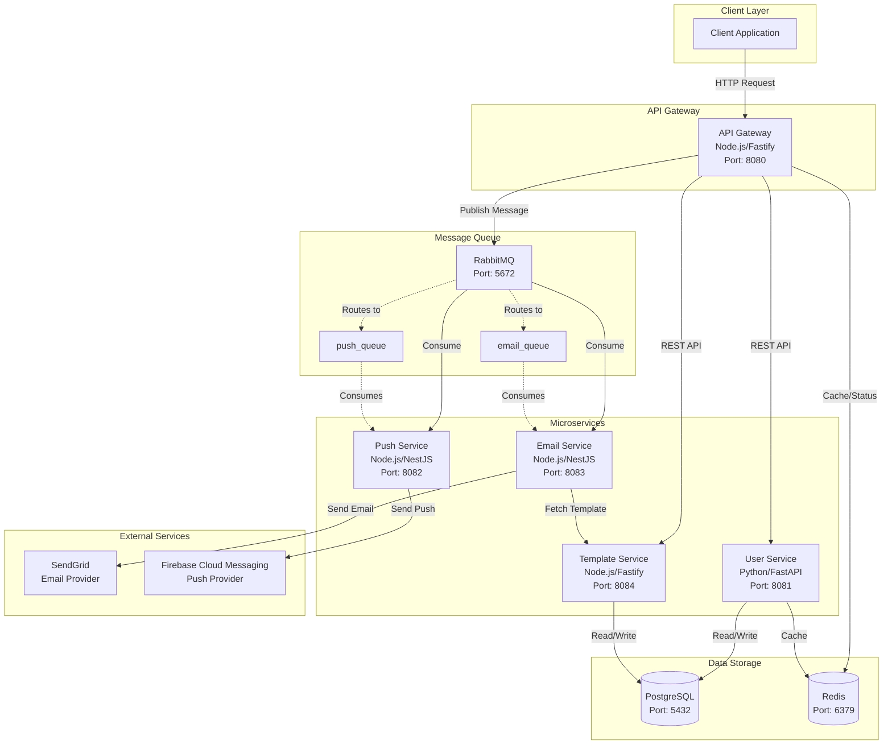

---

## 🔄 Request Flow: Sending a Notification

### Sequence Diagram

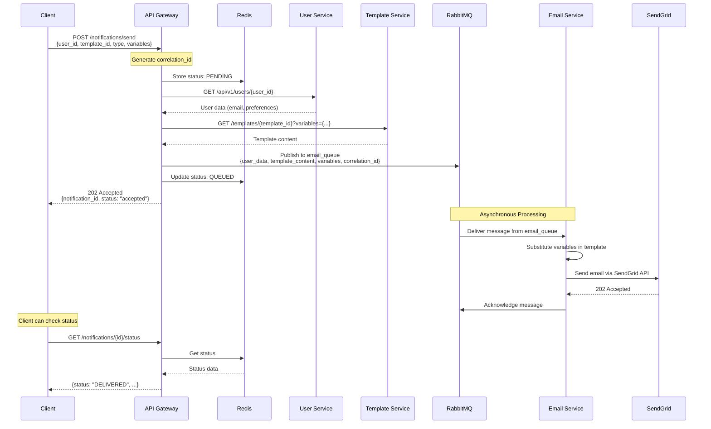

---

## 📊 Data Flow Diagram

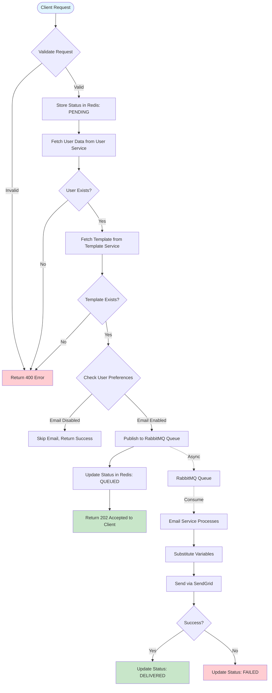

---

## 🗄️ Database Schema Overview

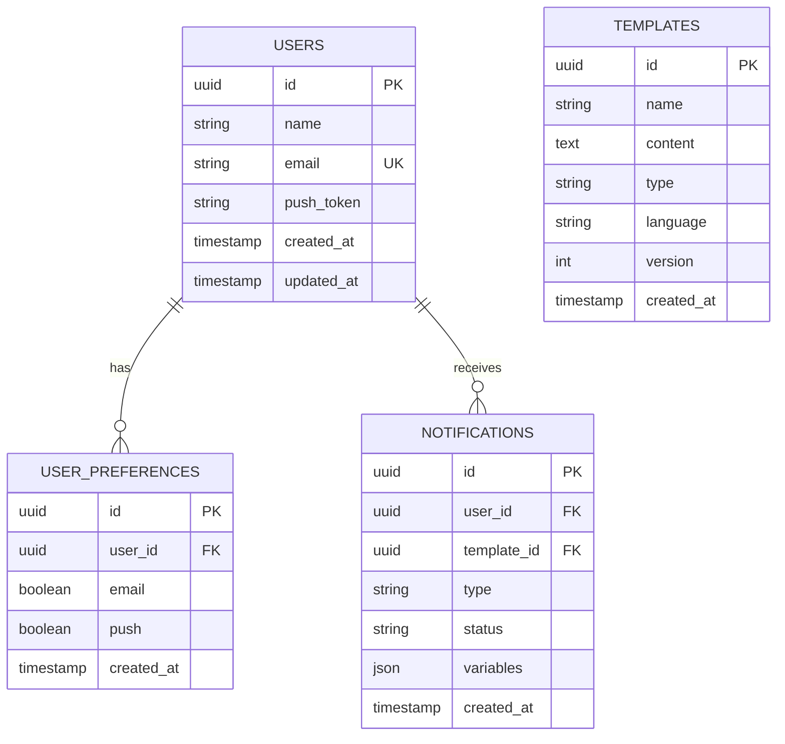

---

## 🔌 Service Communication Patterns

### 1. Synchronous Communication (REST APIs)

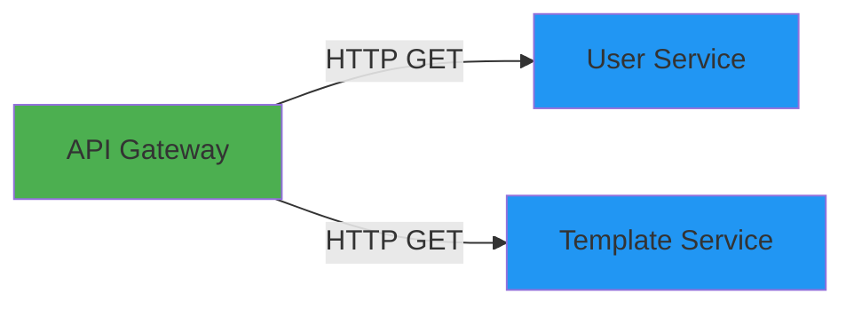

**Used for:**
- Fetching user data
- Fetching template data
- Health checks
- Status queries

### 2. Asynchronous Communication (Message Queue)

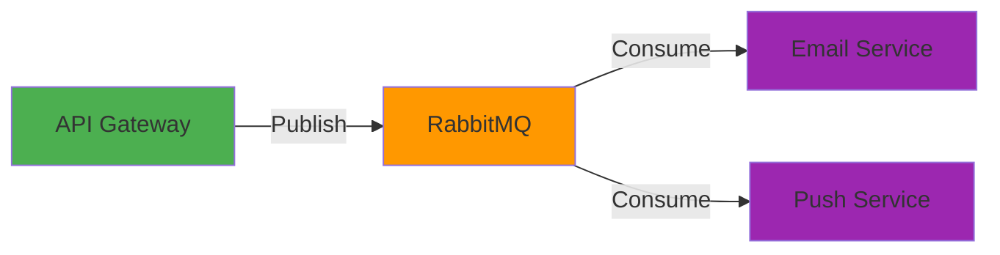

**Used for:**
- Sending notifications (email/push)
- Decoupling services
- Handling high load
- Retry mechanisms

---

## 📦 Message Queue Architecture

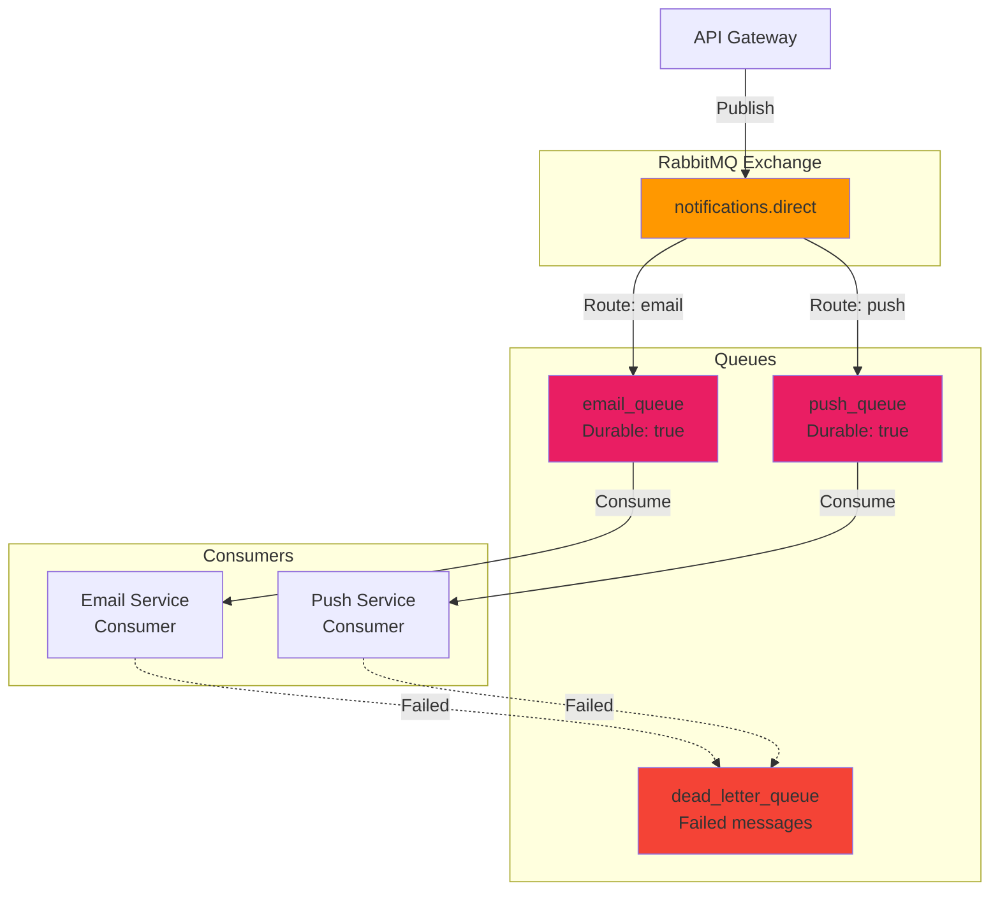

**Queue Configuration:**
- **email_queue**: Handles email notification requests
- **push_queue**: Handles push notification requests
- **dead_letter_queue**: Stores failed messages for retry

---

## 🛠️ Technology Stack

### Services

| Service | Technology | Framework | Port | Purpose |
|---------|-----------|-----------|------|---------|
| **API Gateway** | Node.js | Fastify | 8080 | Entry point, routing, auth |
| **User Service** | Python | FastAPI | 8081 | User management |
| **Email Service** | Node.js | NestJS | 8083 | Email notifications |
| **Push Service** | Node.js | NestJS | 8082 | Push notifications |
| **Template Service** | Node.js | Fastify | 8084 | Template management |

### Infrastructure

| Component | Technology | Port | Purpose |
|-----------|-----------|------|---------|
| **PostgreSQL** | PostgreSQL 13 | 5432 | Primary database |
| **Redis** | Redis 6 | 6379 | Caching, status tracking |
| **RabbitMQ** | RabbitMQ 3 | 5672 | Message queue |

### External Services

| Service | Purpose |
|---------|---------|
| **SendGrid** | Email delivery |
| **Firebase Cloud Messaging** | Push notification delivery |

---

## 🔐 Authentication Flow

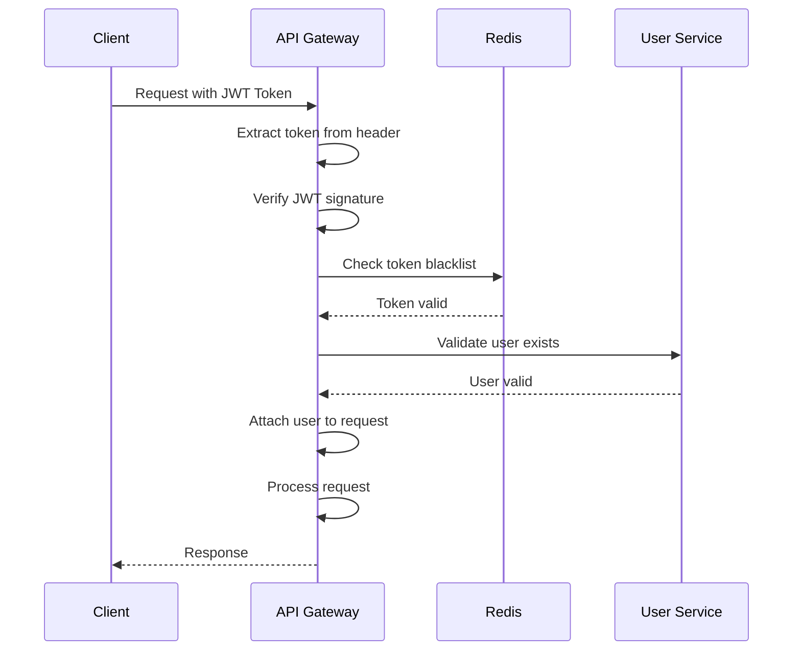

**Note:** For testing, `SKIP_AUTH=true` bypasses authentication.

---

## 📈 Notification Status Lifecycle

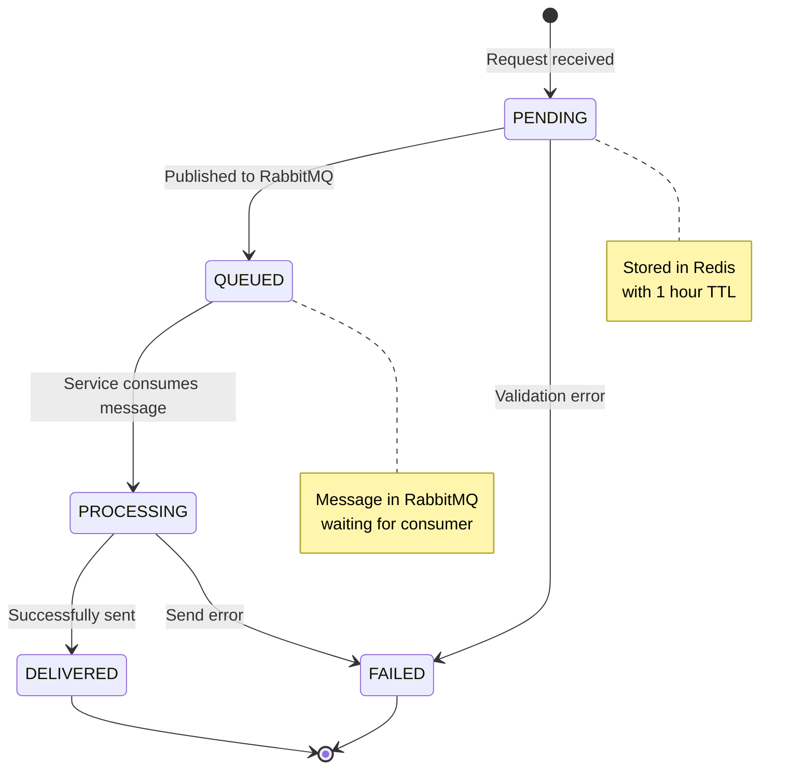

**Status Values:**
- `PENDING`: Request received, being validated
- `QUEUED`: Message published to RabbitMQ
- `PROCESSING`: Service is processing the notification
- `DELIVERED`: Successfully sent to provider
- `FAILED`: Error occurred during processing

---

## 🔄 Complete Notification Flow (Email Example)

### Step-by-Step Process

1. **Client Request**
   ```
   POST /notifications/send
   {
     "user_id": "uuid",
     "template_id": "uuid",
     "notification_type": "email",
     "variables": {"name": "John", "link": "https://..."}
   }
   ```

2. **API Gateway Processing**
   - Generates `correlation_id` (UUID)
   - Stores initial status in Redis: `PENDING`
   - Fetches user data from User Service
   - Fetches template from Template Service
   - Validates user preferences

3. **Message Publishing**
   - Creates message payload with all data
   - Publishes to `email_queue` in RabbitMQ
   - Updates status in Redis: `QUEUED`
   - Returns `202 Accepted` to client

4. **Email Service Processing** (Asynchronous)
   - Consumes message from `email_queue`
   - Substitutes variables in template
   - Calls SendGrid API to send email
   - Updates status in Redis: `DELIVERED` or `FAILED`

5. **Status Checking**
   ```
   GET /notifications/{correlation_id}/status
   Returns: {
     "status": "DELIVERED",
     "timestamp": "...",
     "details": "..."
   }
   ```

---

## 🎨 Visual Component Diagram

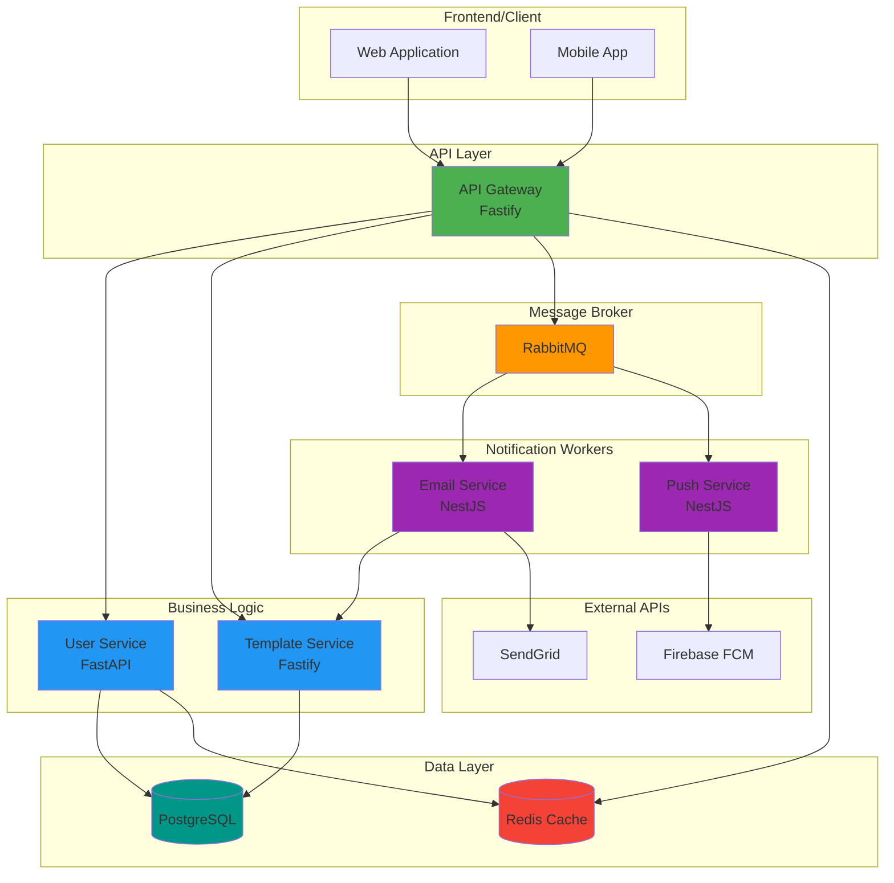

---

## 🚀 Deployment Architecture

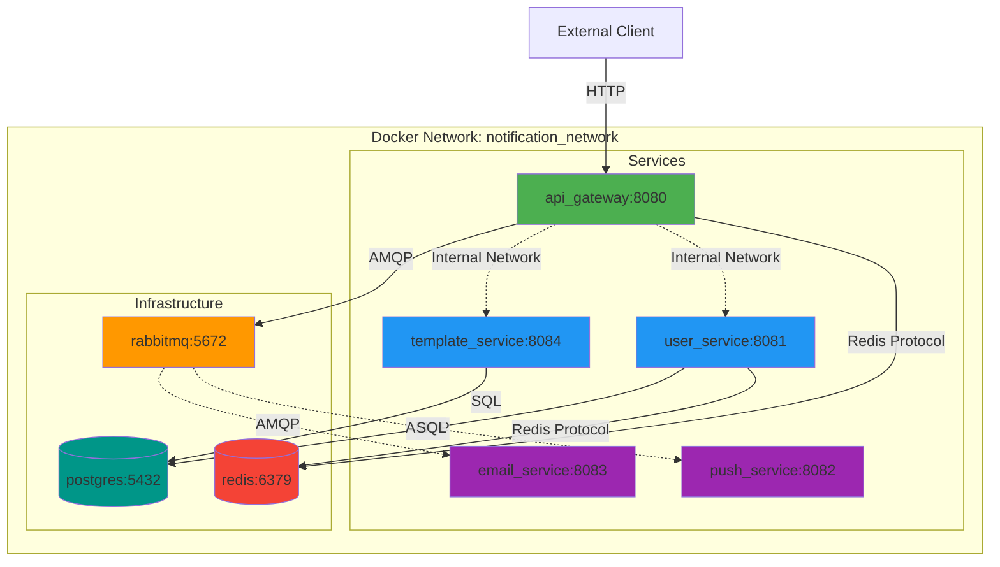

---

## 📝 Key Design Patterns

### 1. **API Gateway Pattern**
- Single entry point for all requests
- Handles authentication, routing, and composition
- Reduces client complexity

### 2. **Message Queue Pattern**
- Decouples services
- Enables asynchronous processing
- Provides resilience and scalability

### 3. **Microservices Pattern**
- Each service has a single responsibility
- Independent deployment and scaling
- Technology diversity (Node.js, Python)

### 4. **Caching Pattern**
- Redis for fast status lookups
- Reduces database load
- Improves response times

### 5. **Template Pattern**
- Centralized template management
- Variable substitution
- Multi-language support

---

## 🔍 Monitoring & Observability

```mermaid
graph LR
    subgraph "Services"
        AG[API Gateway]
        US[User Service]
        ES[Email Service]
        PS[Push Service]
        TS[Template Service]
    end
    
    subgraph "Health Checks"
        HC1[/health endpoints]
    end
    
    subgraph "Logging"
        LOGS[Service Logs]
    end
    
    subgraph "Metrics"
        METRICS[Redis Status<br/>RabbitMQ Metrics]
    end
    
    AG --> HC1
    US --> HC1
    ES --> HC1
    PS --> HC1
    TS --> HC1
    
    AG --> LOGS
    US --> LOGS
    ES --> LOGS
    PS --> LOGS
    TS --> LOGS
    
    AG --> METRICS
    ES --> METRICS
    PS --> METRICS
```

**Health Check Endpoints:**
- `GET /health` - Available on all services
- Returns service status and dependencies

---

## 📚 Summary

The Notification Services Suite is a **well-architected microservices system** that:

✅ **Scales horizontally** - Each service can scale independently  
✅ **Resilient** - Message queues handle failures gracefully  
✅ **Fast** - Redis caching and asynchronous processing  
✅ **Maintainable** - Clear separation of concerns  
✅ **Flexible** - Easy to add new notification types  

The system follows **best practices** for microservices architecture, using appropriate communication patterns (REST for sync, queues for async) and proper data storage strategies (PostgreSQL for persistence, Redis for caching).

---

## 🔗 Related Documentation

- [Deployment Guide](./DEPLOYMENT.md) - How to deploy the system
- [API Documentation](./docs/API_SPEC.md) - API endpoints and schemas
- [Queue Design](./docs/QUEUE_DESIGN.md) - Message queue architecture details
- [Architecture Details](./docs/ARCHITECTURE.md) - Technical architecture

---

**Last Updated:** November 2025

